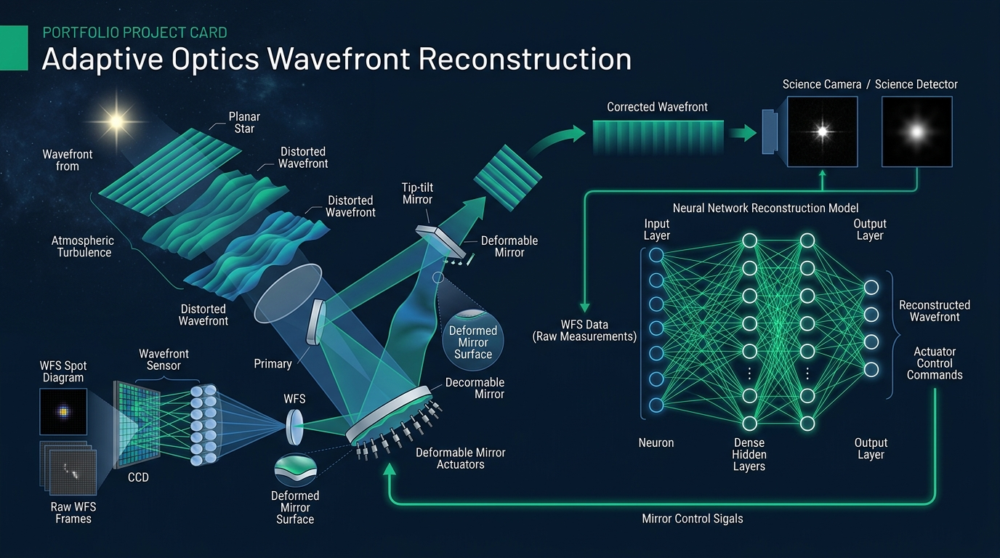

**Grade:** 10/10 (Proposed for Honors) · **Degree:** Physics (University of Oviedo)

[**📄 Download Full Thesis (PDF)**](/uploads/TFG_Fisica_AnxoHerrera.pdf)

## Overview

This thesis investigates deep learning models as **wavefront reconstructors** in Ground Layer Adaptive Optics (GLAO) for solar observation. Atmospheric turbulence distorts the wavefront of incoming light, limiting the resolution of ground-based telescopes. Traditional correction relies on linear Least Squares (LS) estimators, but these struggle with the complex, non-linear distortions present in extended-source solar imaging.

The work proposes and benchmarks **neural network architectures** — Multi-Layer Perceptrons (MLP) and Fully Convolutional Networks (FCN) — as replacements for classical reconstructors, using realistic simulated data from the **Durham Adaptive Optics Simulation Platform (DASP)** under the Kolmogorov turbulence model.

## Methodology

- **Simulation:** Generated optical datasets using DASP with an array of 7 cross-correlation Shack-Hartmann Wavefront Sensors observing solar granulation across Fried parameters $r_0 \in [10, 18]\text{ cm}$
- **Parametric Approach (MLP):** Predicts Zernike polynomial coefficients from sensor slope measurements; compared activation functions (ELU, GELU, ReLU) and network widths
- **Spatial Approach (FCN):** Reconstructs full continuous 2D phase maps pixel-by-pixel directly from focal plane sensor images
- **Training:** Adam optimizer, MSE loss, with Batch Normalization, Dropout, Early Stopping, and ReduceLROnPlateau regularization

## Key Results

- **MLP with ELU activation** achieved an average error reduction of **67.7%** relative to the classical Least Squares estimator across all turbulence conditions
- **FCN** reduced spatial RMS phase error by **15–17.5%** compared to LS, with significantly improved frame-to-frame stability — critical for preventing deformable mirror feedback instabilities
- Both neural approaches consistently outperformed LS across all evaluated turbulence regimes ($r_0 = 10\text{–}18\text{ cm}$)
