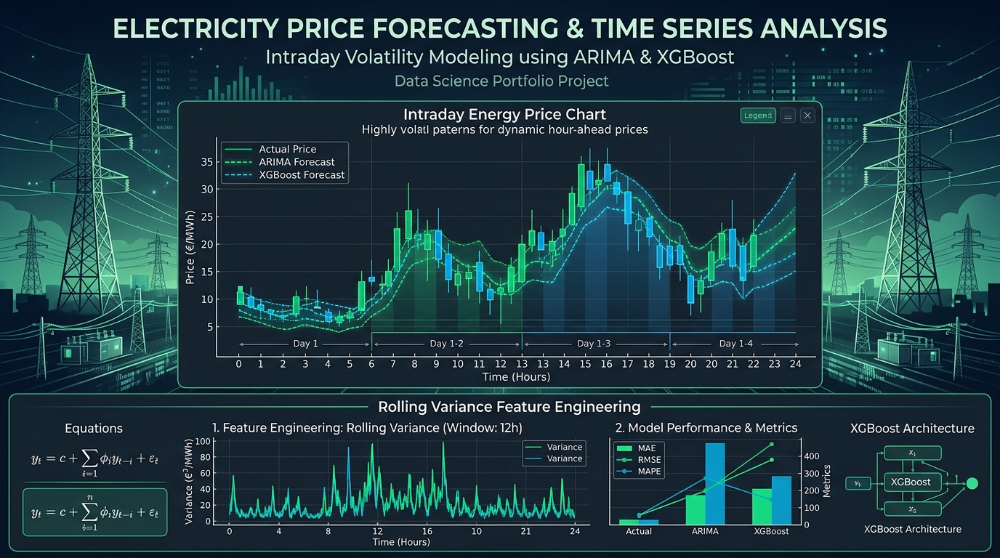

**Event:** Quantitative Hackathon

## Overview

This project tackles the challenge of **intraday electricity price forecasting** in highly volatile energy markets. Developed during a Quantitative Hackathon, the work benchmarks classical and modern time series models to identify the most effective approach for predicting short-term price movements.

Energy markets exhibit extreme volatility driven by supply-demand imbalances, weather shifts, and grid constraints, making accurate forecasting crucial for trading operations and risk management.

## Methodology

- **Models Benchmarked:** ARIMA (classical linear), Prophet (decomposition-based), and XGBoost (gradient boosting)
- **Feature Engineering:** Designed synthetic features using rolling variances at multiple window sizes to capture market microstructure and execution signals
- **Evaluation:** Compared out-of-sample forecast accuracy across models using standard time series metrics

## Key Takeaways

- XGBoost with engineered rolling variance features achieved the best overall forecast accuracy, particularly during high-volatility regimes
- Rolling variance features proved critical for capturing regime changes and volatility clustering patterns in intraday prices
- The project demonstrated the advantage of combining domain-specific feature engineering with modern ML models over purely statistical approaches
